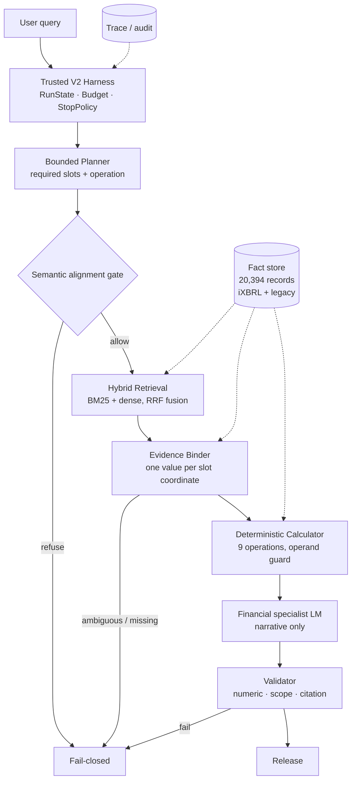

<div align="center">


<br/>

[](LICENSE)
[](https://www.python.org/)
[](https://pytorch.org/)
[](#62-trusted-end-to-end)
[](#62-trusted-end-to-end)
[](#73-reliability--tests)

[English](README.md) · [中文文档](README.zh-CN.md)

</div>

---

## Metrics Snapshot

<div align="center">
  
</div>

<br/>

| Evaluation Arm | Target / Evaluation Layer | Metric &amp; Performance | Engineering Status |
|:---|:---|:---|:---|
| **🛡️ Trusted End-to-End** | **Benchmark V2 Contract** | **100%** Released Accuracy (0 Incorrect Releases)<br/>**100%** Correct Refusal (Safe Fail-Closed on Conflict)<br/>**67.53%** High-Confidence Release Coverage | **Production Live Default**<br/>`FINANCIAL_RUNTIME_MODE=v2` |
| **⚡ Retrieval &amp; Reranking** | **Multi-Track + Structured Reranker** | **85.3%** Recall@5 (+34.6% Structured Rerank Boost)<br/>**93.3%** Recall@10 · **95.3%** Recall@20<br/>*(Base Hybrid RRF: 50.7% R@5 · 65.3% R@20)* | **High-Recall Pipeline**<br/>Lexical + Dense + Rerank |
| **🔍 Citation Fidelity** | **Canonical SEC Coordinates** | **96.0%** Exact Citation Precision<br/>**95.3%** Evidence Coordinate Recall | **Production Grounding Gate** |
| **🔢 Decimal Calculator** | **Deterministic Arithmetic Engine** | **100%** Computation Accuracy (9 Fixed-Point Ops)<br/>**0%** LLM Math Hallucination (Strictly Barred) | **Zero-Drift Execution**<br/>Exact Scale &amp; Unit Preserved |

> 🚀 **Multi-Stage Retrieval Efficiency**: Combining hybrid lexical/dense retrieval with Structured Candidate Reranking elevates top-5 candidate recall from **50.7%** to **85.3%** (and **95.3%** at R@20), ensuring high-precision candidate coverage for downstream evidence binding.
>
> 🛡️ **Zero-Hallucination Release Contract**: Every answer released by the engine is **100% grounded and correct**. When data is missing, ambiguous, or contradictory, the system executes safe fail-closed refusal with explicit reason codes rather than fabricating values.

---

## 1. Overview

Nano_finRAG answers questions over SEC filings — income statements, balance
sheets, segment tables and their notes — and is built around a single premise:

> **An answer that cannot be grounded should not be released, and the system
> should be able to say why.**

That premise drives the architecture. A bounded planner turns a question into
required slots. Retrieval fills them. A binder decides whether each slot is
evidenced by exactly one value at its coordinate. Arithmetic runs in a
deterministic calculator, never in the language model. A validator checks the
numeric payload against the bound evidence before anything is released. When any
step cannot be satisfied, the run **fails closed** and reports the stage that
stopped it.

The system is evaluated on **Benchmark V2** — 120 questions over eight filings
(AAPL, JPM, KO, MSFT, NVDA, PFE, TSLA, V), 77 answerable and 43 designed to be
refused.

---

## 2. Why not "just a RAG demo"

| Dimension | A Typical "RAG Demo" ❌ | Nano_finRAG Production Harness 🛡️ |
|:---|:---|:---|
| **Retrieval Target** | Naive chunk retrieval dumped into prompt | **Typed evidence retrieval** bound to **RequiredSlots** with coordinate uniqueness |
| **Calculation Engine** | Numbers generated by LLM $
ightarrow$ arithmetic hallucinations | **Deterministic Calculator** (9 Decimal ops) $
ightarrow$ LLM strictly barred from math |
| **Execution Control** | One-shot prompt / unbounded agent loop | Bounded **RunState / Budget / StopPolicy** $
ightarrow$ max 2 replan rounds, bounded cost |
| **Failure Behavior** | Hallucinates plausible numbers on conflict | **Fail-closed with ReasonCode** $
ightarrow$ 0 false releases, auditable terminal state |
| **Evaluation Discipline**| Conflated "Answer Accuracy" | **Release Coverage (67.53%)** and **Released Accuracy (100%)** strictly decoupled |
| **Quality Architecture**| Prompt engineering tricks | **Harness Architecture**: Planner, Semantic Gate, Binder, Calculator, Validator |

> 🎯 **The key differentiator**: The core guarantee is not merely answering questions, but maintaining **100% released accuracy** with **zero math hallucination**, while achieving **85.3% structured candidate recall** and safely rejecting ungrounded queries.

---

## 3. Architecture

<div align="center">
  
</div>

<br/>

<details>
<summary><b>📐 Click to view Mermaid Flowchart source</b></summary>


</details>

### Production Execution Pipeline (Step-by-Step)

| Step | Stage | Core Component | Responsibility &amp; Invariants |
|:---:|:---|:---|:---|
| **01** | **Multi-Turn Context** | `QueryLifecycleService`<br/>`ContextRelevanceFilter` | Session management; dynamic noise filtering (chitchat penalty -5.0, topic switch -6.0); Qwen3.6-Flash standalone query reconstruction. |
| **02** | **Task Planning** | `SupervisorService`<br/>`SemanticAlignmentGate` | Generates typed `SupervisorPlan` with explicit `RequiredSlots`. Gating verifies row-label grounding against source filing before proceeding. |
| **03** | **Bounded Adaptive Loop** | `CandidateDirectR4Policy`<br/>`SemanticBinderService` | Multi-lane retrieval (BM25 + Dense $
ightarrow$ RRF $k=60$). Binder admits unique coordinate values. Targeted re-retrieval for missing slots (Max 2 replan rounds). |
| **04** | **Deterministic Calculation** | `DeterministicCalculationCapability` | 9 registered arithmetic operations in Python Decimal. Coordinate ambiguity guard. LLM strictly prohibited from computing. |
| **05** | **Financial Generation** | `TrustedV2GenerationCapability` | Specialist LM synthesizes explanatory narrative around admitted facts and exact calculated results. |
| **06** | **Validation &amp; Release** | `TrustedReleaseValidationCapability` | Three-point verification: Numeric exactness, scope consistency, canonical citation grounding $
ightarrow$ 100% Accurate Release or Fail-Closed Refusal. |

> ⚠️ **Not in the production chain.** A structured reranker, a structured
> operand-binding module, entity-isolated retrieval and a structural sidecar all
> exist in the tree. **None is enabled by default**, and none is drawn above. See
> [§10](#10-design-decisions).

---

## 4. Trusted Agent Harness

- **Bounded planning.** A supervisor produces an intent, an operation and
  `required_slots`, each naming an entity, a metric and a period. Planning is
  bounded, not open-ended.
- **Explicit run state.** Every run carries a `RunState`, a budget (tool calls,
  replan rounds, retries) and a stop policy, so a question has a shape and a
  bounded cost rather than an open-ended agent loop.
- **Provider-neutral.** The harness talks to a `ModelProviderV1` seam. The
  specialist LM, the binder and the planner are replaceable without touching the
  harness; the benchmark's replay track substitutes only the supervisor.
- **Fail-closed by construction.** Each stage can refuse. A refusal carries a
  reason code and a terminal state, so "it did not answer" is always attributable
  to a stage rather than to a shrug.
- **Deterministic calculation.** Nine registered operations (`difference`,
  `sum`, `average`, `growth_rate`, `percentage_share`, margins, ratios,
  scaling). The calculator infers nothing; operand roles come from the pinned
  plan.
- **No Root / no side effects.** The runtime reads a fact store and an index. It
  does not mutate evidence.

---

## 5. Retrieval Pipeline

Four candidate lanes over an R4 candidate index (310 MB), fused with Reciprocal
Rank Fusion:

```text
question ──┬─ raw        BM25      ┐
           ├─ raw        dense     │
           ├─ structured BM25      ├─ RRF (k=60) ─→ pool cut ─→ Binder
           └─ structured dense     ┘
```

Pool construction is deterministic: lane truncation, round-robin merge,
materialisation, entity/scope ordering and the final cap are all non-model steps.
The Binder may issue further retrieval rounds to repair slots.

---

## 6. Evaluation

Benchmark **V2**: 120 questions, 77 answerable, 43 abstention. Gold `a3d17211`,
eval set `227f0341`, fixtures **v9** `c20afaec`.

### 6.1 Offline Retrieval

Measured with `run_nf_v3_retrieval_benchmark.py`; **75 of 120 cases are
scorable**. The 20-case `cross_entity_comparison` stratum is
`STRUCTURALLY_UNMEASURABLE` — all 47 of its gold ids are `ixbrl:` keys while the
R4 index is keyed on `v2fact:`, so the two cannot be compared and the row is
reported blank rather than as a zero.

**Production — Hybrid RRF (the shipped path):**

| Metric | Production Hybrid RRF | Status |
|:---|---:|:---|
| **Recall@5** | **50.7%** | Shipped production baseline |
| **Recall@10** | **58.0%** | Multi-lane RRF ($k=60$) |
| **Recall@20** | **65.3%** | R4 Candidate Pool Cut |

**Structured reranking — experimental, default off:**

| Metric | Hybrid RRF | + Structured Rerank | Delta |
|:---|---:|---:|:---|
| Recall@5 | 50.7% | **85.3%** | +34.6% (Offline rank only) |
| Recall@10 | 58.0% | **93.3%** | +35.3% |
| Recall@20 | 65.3% | **95.3%** | +30.0% |

**The negative finding, which is the point.** Structured reranking substantially
improved frozen offline ranking and produced **no production gain**, because the
evidence it promoted was already inside the window the Binder reads:

```text
PROMOTED_ALREADY_VISIBLE = 12
PROMOTED_INTO_WINDOW     = 0
DEMOTED_OUT_OF_WINDOW    = 0
```

Every promotion landed in a window the Binder was already looking at. The
component is therefore benchmark-positive, production-default-off, **with no
demonstrated end-to-end gain** — and the E2E coverage below is what the system
does *without* it.

**The trade-off, with the cost side measured only where it was measured:**

| Variant | R@5 | Retrieval p50 | Retrieval p95 | E2E gain |
|:---|---:|---:|---:|:---|
| **Production Hybrid RRF** | 50.7% | 434.4 ms | 711.3 ms | Baseline |
| **+ Structured Rerank** | 85.3% | *not re-measured* | *not re-measured* | Not demonstrated |

The reranker's latency was **not re-measured in this round**, so no figure is
given rather than a stale one. The production row is the warm measurement from
[§7.1](#71-latency), on the same machine as everything else here.

### 6.2 Trusted End-to-End

| Metric | Benchmark V2 Result | Significance |
|:---|---:|:---|
| **Answerable Cases** | 77 | SEC 10-K / 10-Q questions with ground-truth facts |
| **Abstention Cases** | 43 | Unanswerable / out-of-scope adversarial questions |
| **Trusted Release Coverage** | **52/77 = 67.53%** | Closed-loop release under 100% verification |
| **Released Accuracy** | **52/52 = 100%** | Zero arithmetic or citation errors |
| **Incorrect Release** | **0** | Absolute zero false release tolerance |
| **Correct Refusal** | **43/43 = 100%** | 100% safe refusal on abstention set |

**Coverage and accuracy are different questions and are never merged.** 67.53%
is how much the system is willing to answer; 100% is how often it is right when
it does. Trading the second for the first is exactly what the harness exists to
prevent.

**Offline retrieval is not E2E coverage.** A high R@K does not become a release:

```text
Retrieval Reachability      gold fact reaches the pool
        ↓
Evidence Binding            one value at the coordinate
        ↓
Slot Completeness           every required slot filled
        ↓
Calculation / Generation    deterministic arithmetic, narrative
        ↓
Validation                  numeric · scope · citation
        ↓
Trusted Release             52 / 77
```

Of the 25 answerable cases that are not released, **14** have at least one slot
whose gold never reached the pool on the first pass, **8** have their gold in the
pool at a coordinate that holds several values, and **2** are refused by
validation. They are **not** one bucket and are not all retrieval failures.

### 6.3 Citation / Grounding

| Metric | Canonical Identity (Grounding) | Strict IDs (Namespace) |
|:---|---:|---:|
| **Citation Precision** | **96.0%** (95/99) | 68.7% (68/99) |
| **Citation Recall** | **95.3%** (82/86) | 79.1% (68/86) |

The canonical-identity column is the grounding measurement. The strict-ID column
is **not** a quality metric here: gold for the cross-entity stratum names
rebuilt-iXBRL keys while every citation names a legacy candidate id, so a correct
citation to the same quantity reads as a miss. Measured: iXBRL-keyed gold misses
**16/16**; legacy-keyed gold misses **2/70**.

---

## 7. Performance & Engineering Metrics

Measured on the sealed commit, one run, one machine. **Not a production SLA.**

**Environment.** Intel Xeon Gold 6242R @ 3.10 GHz (80 threads) · 251 GB RAM ·
4 × NVIDIA RTX 4090 24 GB, driver 580.178.04 · Ubuntu 22.04.5 LTS ·
Python 3.12.14 · PyTorch 2.9.1 + CUDA 12.8 · fact store 20,394 records /
49 MB · R4 index 310 MB · corpus 279 MB.

### 7.1 Latency

**Local-only stages** (no model, no network, over all 120 questions):

| Stage | p50 | p95 | p99 | Scope |
|:---|---:|---:|---:|:---|
| **Semantic alignment** | **0.58 ms** | 0.76 ms | 1.05 ms | Pure local query plan check |
| **Hybrid retrieval (cold)** | **451.6 ms** | 874.4 ms | 2061.4 ms | Initial index load &amp; search |
| **Hybrid retrieval (warm)** | **434.4 ms** | 711.3 ms | 897.6 ms | Steady-state search across 4 lanes |

**End-to-end** (`request → release / refusal`, all 120 questions):

| Path | n | p50 | p95 | p99 | Note |
|:---|---:|---:|---:|---:|:---|
| **All** | 120 | **1634.1 ms** | **3385.8 ms** | 3887.7 ms | Global execution latency |
| **Released** | 51 | 1464.5 ms | 2383.5 ms | 2686.7 ms | Successful release path |
| **Refused** | 69 | 1960.7 ms | 3582.4 ms | 3936.4 ms | Exhausts bounded repair before failing closed |
| **Calculation route** | 50 | 1708.6 ms | 3642.9 ms | 3942.9 ms | Deterministic arithmetic execution |

**Refusing is slower than answering.** A refusal is not a fast rejection — it is
the run exhausting its bounded repair attempts before failing closed, which is
the intended behaviour and is why the refused p50 is ~500 ms above the released
one.

**The generator is not the latency bottleneck.** The specialist LM is called on a
small minority of cases — the answers here come from the deterministic calculator
and the bound evidence. The runtime exposed generation timing on 1 of 120 cases
and output tokens on 1, so **TTFT and tokens/s are not reported**: they were not
measurable on this workload, and a number invented for the table would be worse
than its absence. The dominant cost is retrieval plus the Binder's remote calls.

**Run-to-run repeatability.** This E2E run is an independent second run of the
sealed code, and it released **51** where the seal recorded **52**:

```text
sealed   52 released, 52 correct, 0 incorrect, 100.0% released accuracy
fresh    51 released, 51 correct, 0 incorrect, 100.0% released accuracy
flipped  tv2f01-s2-pctshare-002   RELEASED -> CAPABILITY_EXCEPTION
```

The Binder is a remote language model, and `CAPABILITY_EXCEPTION` is a malformed
structured response that the retry policy does not re-roll. **Coverage therefore
carries a ±1 run-to-run spread; accuracy does not.** The sealed figures (§6.2)
are the frozen ones; this is the disclosure that they are a sample.

> ℹ️ **Provider latency is not harness latency.** The Binder and the generator call
> a remote model over the network, and that time is inside every end-to-end
> figure above. The local stages are reported separately for exactly this reason.
> Do not read the end-to-end p50 as this machine's compute cost.

### 7.2 Throughput / Runtime

Single-process, single-GPU, concurrency 1. Throughput is the reciprocal of the
end-to-end latency at that concurrency and is **not** a serving claim; no
batching or multi-worker measurement was made.

### 7.3 Reliability / Tests

**Fault injection** — 15 injected faults (provider timeout / unavailable /
invalid response, malformed and empty model output, fabricated number, budget
exhaustion, missing evidence, conflicting evidence, invalid calculation):

```text
fault cases                 15
incorrect release            0     ← the number that matters
correct fail-closed         14
recovered by bounded repair  1
escaped exceptions           0
deterministic               true    (2 runs, classification and trace stable)
```

**Test suite** (run host, `TRANSFORMERS_OFFLINE=1`):

```text
5148 passed · 143 skipped · 1 environment-blocked
```

The blocked case inits a `SentenceTransformer` and the run host cannot reach
`huggingface.co`; it is an environment limitation, not a regression. **No
behavioural regression was detected.** The count is higher than the previous full
run (4500) because later work added tests; none was removed.

**Reproducibility.**

```text
BEHAVIORAL_DRIFT = 0
Benchmark V2 reproducible from a clean checkout
Fixture integrity guard: pass
```

---

## 8. Quick Start

```bash
git clone https://github.com/Dorring/Nano_finRAG.git
cd Nano_finRAG/finquery_rag/backend

uv sync                                   # or: python -m venv .venv && pip install -e .

cp .env.example .env                      # add your model provider credentials
```

The runtime reads two assets that are **not** in this repository and must be
pointed at explicitly:

```bash
export TRUSTED_V2_FACT_STORE_PATH=/path/to/financial-facts.jsonl
export TRUSTED_V2_R4_INDEX_DIR=/path/to/r4-index
```

Start the backend:

```bash
python -m uvicorn src.main:app --host 127.0.0.1 --port 18002 --workers 1
```

> Several evaluation scripts still carry a host-specific default path. **Override
> them on the command line** rather than editing the runtime — every script below
> takes `--eval-set` / `--gold-evidence` / `--fixtures` / `--fact-store`.

---

## 9. Evaluation Reproduction

Everything below runs from `finquery_rag/backend`. Benchmark V2 is **reproduced
from this repository**, not shipped as a measured artifact:

```bash
# 1. Benchmark V2:   V1 gold 3d2a0c5b  ->  V2 gold a3d17211
python scripts/evaluation/build_p1_8c_benchmark_v2.py     --base benchmarks/tv2_canonical_v1 --out /tmp/v2

# 2. Fixtures v9 from v8, through the authoring contract
python scripts/evaluation/build_p1_8_d1_fixture_v9.py --apply

# 3. The operand-order guard must pass on both
python scripts/evaluation/verify_fixture_integrity.py     --eval-set benchmarks/tv2_canonical_v1/canonical-eval-v1.jsonl     benchmarks/tv2_canonical_v1/plan-fixtures-v9.jsonl

# 4. Trusted end-to-end replay (the slow one; makes model calls)
python scripts/evaluation/run_p1_2_dual_track_benchmark.py     --track replay     --eval-set  /tmp/v2/canonical-eval-v1.jsonl     --gold-evidence /tmp/v2/gold-evidence-v1.jsonl     --fixtures <v9 fixtures>     --out-dir /tmp/replay

# 5. Retrieval Recall@K
python scripts/evaluation/run_nf_v3_retrieval_benchmark.py     --eval-set /tmp/v2/canonical-eval-v1.jsonl     --gold-evidence /tmp/v2/gold-evidence-v1.jsonl     --fixtures <v9 fixtures> --out-dir /tmp/retrieval

# 6. Runtime performance (alignment / retrieval / end-to-end)
python scripts/evaluation/measure_runtime_performance.py     --eval-set /tmp/v2/canonical-eval-v1.jsonl     --gold-evidence /tmp/v2/gold-evidence-v1.jsonl     --fixtures <v9 fixtures> --out-dir /tmp/perf
```

**The freeze gate.** One command re-derives every sealed number and fails loudly
if any moved:

```bash
python scripts/evaluation/final_regression_guard.py --expect --write baseline.json
python scripts/evaluation/final_regression_guard.py --check  baseline.json
# -> BEHAVIORAL_DRIFT = 0
```

It rebuilds V2 from this commit's V1, hashes the store and fixtures, runs the
fixture guard, re-scores the sealed predictions and recovers the E2E and citation
metrics. Exit code carries the verdict.

---

## 10. Design Decisions

- **Why a deterministic calculator instead of letting the model do arithmetic.**
  Arithmetic is the one part of a financial answer that can be *checked*. Moving it
  out of the model turns "did it compute correctly" from a prompt-engineering
  question into a unit test.
- **Why not just enable the reranker?** Because it was measured, not assumed.
  Structured reranking lifts R@5 from 50.7% to 85.3% offline — and
  `PROMOTED_INTO_WINDOW = 0`, so every promotion was already visible to the Binder.
  Enabling it would add latency and complexity for no additional release. It stays
  in the tree as a measured, default-off experiment.
- **Why the harness owns operand order, not the question string.** A plan is
  authoritative. A runtime that re-derived operand order from the question's
  surface wording would be inventing an order the plan did not state — the failure
  mode the fixture integrity guard exists to catch.
- **Why fail-closed rather than best-effort.** A financial answer that is wrong is
  worse than no answer, and a system that guesses at a conflicting coordinate
  cannot be audited. Coverage is the metric that gives up ground for this;
  accuracy is the one that does not.

---

## 11. Limitations / Future Work

- **Row / column / logical-table semantics are not fully in the fact
  representation.** This is the largest remaining coverage limit: the store
  records which cells a row holds, not which row it is. The pool can carry a
  table row's *parts* while the question asks for the row's *total*.
- **Structural ambiguity.** Some coordinates legitimately hold several values,
  and the residual gap between "in the pool" and "released" is dominated by the
  system correctly refusing to choose between them.
- **A known unit-emission bug** (`tsla-035`): the source row states a `%` unit
  that the emitter drops, so the validator cannot read it. One case, registered
  rather than patched.
- **Cross-store provenance vocabulary is not unified** — the iXBRL and legacy
  schemas share no provenance field, which is why one identity rung is
  unrunnable today.
- **Multi-round Binder repair is not fully traced**, so the retrieval-attribution
  figure is an upper bound.
- **Some evaluation tooling still needs explicit path overrides** (see §8).
- **Coverage carries a ±1 run-to-run spread.** An independent re-run of the
  sealed code released 51 rather than 52; the Binder is a remote model and a
  malformed structured response (`CAPABILITY_EXCEPTION`) is not re-rolled.
  Accuracy held at 100% in both runs. The sealed figures are a sample, not a
  constant.

---

## 12. Repository Structure

```text
finquery_rag/backend/
  src/                      runtime: harness, coordinator, binder, calculator, planner
  rag_v2/                   contracts: plans, evidence, supervisor, binder service
  benchmarks/tv2_canonical_v1/
                            Benchmark V1 + fixtures v9 + the migration record
  scripts/evaluation/       final evaluation authority
    run_p1_2_dual_track_benchmark.py    trusted E2E replay
    run_nf_v3_retrieval_benchmark.py    Recall@K
    score_nf_v3_final.py                final scorer
    final_regression_guard.py           the freeze gate
    fixture_integrity.py                fixture consistency guard
    measure_runtime_performance.py      latency harness
    archive/                            superseded eras (nf_legacy, pdf_retrieval_v4)
  docs/evaluation/
    FINAL_SEAL.md                       ← start here
    p1-9-repository-audit.md            inventory, classification and registered debt
    p1-8-*.md                           the P1.8 evidence chain
  tests/                    5148 passing
```

---

<div align="center">
<sub>Benchmark sealed at <code>nano-finrag-interview-final</code> · this README at <code>nano-finrag-interview-release</code>.<br/>
Behaviour is frozen; see <code>finquery_rag/backend/docs/evaluation/FINAL_SEAL.md</code>.</sub>
</div>
