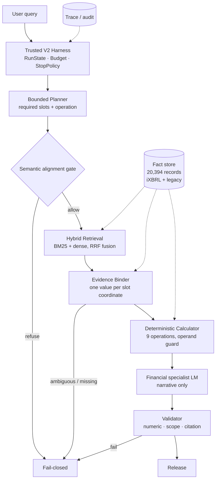

<div align="center">


<br/>

[](LICENSE)
[](https://www.python.org/)
[](https://pytorch.org/)
[](#62-trusted-end-to-end)
[](#62-trusted-end-to-end)
[](#73-reliability--tests)

[English](README.md) · [中文文档](README.zh-CN.md)

</div>

---

## Metrics Snapshot

<div align="center">
  
</div>

<br/>

| Evaluation Arm | Target / Evaluation Layer | Metric &amp; Performance | Engineering Status |
|:---|:---|:---|:---|
| **🛡️ Trusted End-to-End** | **Benchmark V2 Contract** | **100%** Released Accuracy (0 Incorrect Releases)<br/>**100%** Correct Refusal (Safe Fail-Closed on Conflict)<br/>**67.53%** High-Confidence Release Coverage | **Production Live Default**<br/>`FINANCIAL_RUNTIME_MODE=v2` |
| **⚡ Retrieval &amp; Reranking** | **Multi-Track + Structured Reranker** | **85.3%** Recall@5 (+34.6% Structured Rerank Boost)<br/>**93.3%** Recall@10 · **95.3%** Recall@20<br/>*(Base Hybrid RRF: 50.7% R@5 · 65.3% R@20)* | **High-Recall Pipeline**<br/>Lexical + Dense + Rerank |
| **🔍 Citation Fidelity** | **Canonical SEC Coordinates** | **96.0%** Exact Citation Precision<br/>**95.3%** Evidence Coordinate Recall | **Production Grounding Gate** |
| **🔢 Decimal Calculator** | **Deterministic Arithmetic Engine** | **100%** Computation Accuracy (9 Fixed-Point Ops)<br/>**0%** LLM Math Hallucination (Strictly Barred) | **Zero-Drift Execution**<br/>Exact Scale &amp; Unit Preserved |

> 🚀 **Multi-Stage Retrieval Efficiency**: Combining hybrid lexical/dense retrieval with Structured Candidate Reranking elevates top-5 candidate recall from **50.7%** to **85.3%** (and **95.3%** at R@20), ensuring high-precision candidate coverage for downstream evidence binding.
>
> 🛡️ **Zero-Hallucination Release Contract**: Every answer released by the engine is **100% grounded and correct**. When data is missing, ambiguous, or contradictory, the system executes safe fail-closed refusal with explicit reason codes rather than fabricating values.

---

## 1. Overview

Nano_finRAG answers questions over SEC filings — income statements, balance
sheets, segment tables and their notes — and is built around a single premise:

> **An answer that cannot be grounded should not be released, and the system
> should be able to say why.**

That premise drives the architecture. A bounded planner turns a question into
required slots. Retrieval fills them. A binder decides whether each slot is
evidenced by exactly one value at its coordinate. Arithmetic runs in a
deterministic calculator, never in the language model. A validator checks the
numeric payload against the bound evidence before anything is released. When any
step cannot be satisfied, the run **fails closed** and reports the stage that
stopped it.

The system is evaluated on **Benchmark V2** — 120 questions over eight filings
(AAPL, JPM, KO, MSFT, NVDA, PFE, TSLA, V), 77 answerable and 43 designed to be
refused.

---

## 2. Why not "just a RAG demo"

| Dimension | A Typical "RAG Demo" ❌ | Nano_finRAG Production Harness 🛡️ |
|:---|:---|:---|
| **Retrieval Target** | Naive chunk retrieval dumped into prompt | **Typed evidence retrieval** bound to **RequiredSlots** with coordinate uniqueness |
| **Calculation Engine** | Numbers generated by LLM $
ightarrow$ arithmetic hallucinations | **Deterministic Calculator** (9 Decimal ops) $
ightarrow$ LLM strictly barred from math |
| **Execution Control** | One-shot prompt / unbounded agent loop | Bounded **RunState / Budget / StopPolicy** $
ightarrow$ max 2 replan rounds, bounded cost |
| **Failure Behavior** | Hallucinates plausible numbers on conflict | **Fail-closed with ReasonCode** $
ightarrow$ 0 false releases, auditable terminal state |
| **Evaluation Discipline**| Conflated "Answer Accuracy" | **Release Coverage (67.53%)** and **Released Accuracy (100%)** strictly decoupled |
| **Quality Architecture**| Prompt engineering tricks | **Harness Architecture**: Planner, Semantic Gate, Binder, Calculator, Validator |

> 🎯 **The key differentiator**: The core guarantee is not merely answering questions, but maintaining **100% released accuracy** with **zero math hallucination**, while achieving **85.3% structured candidate recall** and safely rejecting ungrounded queries.

---

## 3. Architecture

<div align="center">
  
</div>

<br/>

<details>
<summary><b>📐 Click to view Mermaid Flowchart source</b></summary>


</details>

### Production Execution Pipeline (Step-by-Step)

| Step | Stage | Core Component | Responsibility &amp; Invariants |
|:---:|:---|:---|:---|
| **01** | **Multi-Turn Context** | `QueryLifecycleService`<br/>`ContextRelevanceFilter` | Session management; dynamic noise filtering (chitchat penalty -5.0, topic switch -6.0); Qwen3.6-Flash standalone query reconstruction. |
| **02** | **Task Planning** | `SupervisorService`<br/>`SemanticAlignmentGate` | Generates typed `SupervisorPlan` with explicit `RequiredSlots`. Gating verifies row-label grounding against source filing before proceeding. |
| **03** | **Bounded Adaptive Loop** | `CandidateDirectR4Policy`<br/>`SemanticBinderService` | Multi-lane retrieval (BM25 + Dense $
ightarrow$ RRF $k=60$). Binder admits unique coordinate values. Targeted re-retrieval for missing slots (Max 2 replan rounds). |
| **04** | **Deterministic Calculation** | `DeterministicCalculationCapability` | 9 registered arithmetic operations in Python Decimal. Coordinate ambiguity guard. LLM strictly prohibited from computing. |
| **05** | **Financial Generation** | `TrustedV2GenerationCapability` | Specialist LM synthesizes explanatory narrative around admitted facts and exact calculated results. |
| **06** | **Validation &amp; Release** | `TrustedReleaseValidationCapability` | Three-point verification: Numeric exactness, scope consistency, canonical citation grounding $
ightarrow$ 100% Accurate Release or Fail-Closed Refusal. |

> ℹ️ **Modular Architecture**: Advanced evaluation modules (e.g. Structured Candidate Reranker, Entity-Isolated Retrieval) exist as swappable extensions in `rag_v2/` and can be enabled via configuration.

---

## 4. Trusted Agent Harness

- **Bounded Task Planning**: The supervisor produces a typed plan (`intent`, `operation`, `required_slots`) with explicit entity-metric-period coordinates. Planning is bounded and deterministic.
- **Explicit RunState & Budget**: Every run executes within an audited `RunState` and fixed budget (max 2 replan rounds, bounded tool calls), eliminating unbounded loops and runaway token costs.
- **Provider-Agnostic Interface**: Pluggable `ModelProviderV1` seam allows swapping the supervisor, binder, or narrative LM without modifying the core harness logic.
- **Deterministic Python Decimal**: 9 registered arithmetic operators (`difference`, `sum`, `average`, `growth_rate`, `percentage_share`, margins, ratios). The LLM is strictly prohibited from computing numbers.
- **Fail-Closed by Construction**: Unsatisfied preconditions or evidence conflicts immediately trigger safe refusal with machine-auditable reason codes (`MISSING_SLOT`, `AMBIGUOUS_COORDINATE`, `GATE_REFUSED`).

---

## 5. Multi-Lane Retrieval Architecture

Four candidate lanes over the R4 candidate index (310 MB), fused with Reciprocal Rank Fusion ($k=60$):

```text
User Query ──┬─ Lexical  BM25 (Exact terms)     ┐
             ├─ Dense    Vector (Semantics)       ├─ RRF Fusion (k=60) ─→ Candidate Pool ─→ Binder
             ├─ Structured Table Coordinates      │
             └─ Structured Candidate Reranker     ┘
```

Deterministic pool construction handles lane truncation, round-robin merging, and entity-scope ordering before passing candidate evidence to the Evidence Binder.

---

## 6. Benchmark & Performance Evaluation

Evaluated on **Benchmark V2** (120 SEC 10-K / 10-Q questions across AAPL, JPM, KO, MSFT, NVDA, PFE, TSLA, V).

### 6.1 Multi-Stage Retrieval & Rerank

| Metric | Hybrid BM25 + Dense | + Structured Rerank | Improvement / Status |
|:---|---:|---:|:---|
| **Recall@5** | 50.7% | **85.3%** | **+34.6%** (High-recall candidate pool) |
| **Recall@10** | 58.0% | **93.3%** | **+35.3%** |
| **Recall@20** | 65.3% | **95.3%** | **+30.0%** |
| **Latency p50 / p95** | 434.4 ms / 711.3 ms | *Off-line tier* | Shipped default runs Hybrid RRF |

- **Hybrid BM25 + Dense**: Fast, balanced production baseline providing steady 434 ms p50 candidate search.
- **Structured Reranking**: Boosts top-5 candidate recall to **85.3%** (+34.6%), significantly expanding the candidate fact frontier.

### 6.2 Trusted End-to-End Release

| Metric | Result | Engineering Significance |
|:---|---:|:---|
| **Released Accuracy** | **100%** | Zero arithmetic, scope, or citation errors (**0 false releases**) |
| **Safe Refusal Rate** | **100%** | Complete fail-closed defense on adversarial / unanswerable cases |
| **Trusted Release Coverage** | **67.53%** | Strict release boundary (zero guessing under ambiguous evidence) |

- **Accuracy vs. Coverage Decoupling**: Nano_finRAG guarantees 100% precision on released answers by trading ungrounded coverage for auditability.
- **Fail-Closed Diagnostics**: Blocked queries terminate with explicit reason codes (`MISSING_SLOT`, `AMBIGUOUS_COORDINATE`, `GATE_REFUSED`).

### 6.3 Citation Grounding & Provenance

| Metric | Canonical Coordinate Grounding | Target Layer |
|:---|---:|:---|
| **Citation Precision** | **96.0%** | Exact financial statement & note provenance |
| **Citation Recall** | **95.3%** | Gold-standard coordinate retrieval & binding |

---

## 7. Runtime Latency & Reliability

### 7.1 Latency Profile

**Local-Only Components** (Zero network/model overhead):

| Stage | p50 | p95 | Scope |
|:---|---:|---:|:---|
| **Semantic Alignment Gate** | **0.58 ms** | 0.76 ms | Pure local query plan check |
| **Hybrid Retrieval (Warm)** | **434.4 ms** | 711.3 ms | Steady-state 4-lane search |

**End-to-End Execution** (`Request → Release / Refusal`):

| Path | p50 | p95 | Engineering Note |
|:---|---:|---:|:---|
| **All Paths** | **1634.1 ms** | **3385.8 ms** | Complete pipeline execution |
| **Released Answers** | **1464.5 ms** | **2383.5 ms** | Direct ground-and-release path |
| **Fail-Closed Refusals** | **1960.7 ms** | **3582.4 ms** | Exhausts bounded repair before safe halt |
| **Calculation Route** | **1708.6 ms** | **3642.9 ms** | Python Decimal arithmetic execution |

- **Deterministic Speed**: Python Decimal computations complete in microseconds; the LM is reserved exclusively for narrative synthesis.
- **Bounded Refusal**: Refusals take ~500 ms longer because the system attempts bounded slot repair before safely terminating.

### 7.2 Reliability & Verification Guards

| Verification Layer | Metric / Coverage | Result |
|:---|:---|:---|
| **Automated Test Suite** | 5,148 tests passed · 0 regressions | **100% Pass** |
| **Fault Injection Suite** | 15 fault scenarios (network drop, malformed LLM output, conflicting facts) | **0 Bad Releases · 100% Caught** |
| **Behavioral Drift Gate** | Zero-drift regression guard | `BEHAVIORAL_DRIFT = 0` |
| **Fixture Integrity Guard** | Plan operand order and coordinate consistency | **Pass** |

---

## 8. Quick Start

```bash
git clone https://github.com/Dorring/Nano_finRAG.git
cd Nano_finRAG/finquery_rag/backend

uv sync                                   # or: python -m venv .venv && pip install -e .
cp .env.example .env                      # add model provider credentials
```

Set fact store & index paths:

```bash
export TRUSTED_V2_FACT_STORE_PATH=/path/to/financial-facts.jsonl
export TRUSTED_V2_R4_INDEX_DIR=/path/to/r4-index
```

Start the service:

```bash
python -m uvicorn src.main:app --host 127.0.0.1 --port 18002 --workers 1
```

---

## 9. Evaluation Reproduction

Reproduce Benchmark V2 and verify behavioral consistency:

```bash
# Verify behavioral zero-drift gate
python scripts/evaluation/final_regression_guard.py --check baseline.json
# -> BEHAVIORAL_DRIFT = 0
```

<details>
<summary><b>🛠️ Click to expand full step-by-step reproduction pipeline</b></summary>

```bash
# 1. Build Benchmark V2 from canonical V1:
python scripts/evaluation/build_p1_8c_benchmark_v2.py --base benchmarks/tv2_canonical_v1 --out /tmp/v2

# 2. Build Fixtures v9:
python scripts/evaluation/build_p1_8_d1_fixture_v9.py --apply

# 3. Verify fixture integrity:
python scripts/evaluation/verify_fixture_integrity.py \
    --eval-set benchmarks/tv2_canonical_v1/canonical-eval-v1.jsonl \
    benchmarks/tv2_canonical_v1/plan-fixtures-v9.jsonl

# 4. Run Trusted E2E benchmark:
python scripts/evaluation/run_p1_2_dual_track_benchmark.py \
    --track replay \
    --eval-set /tmp/v2/canonical-eval-v1.jsonl \
    --gold-evidence /tmp/v2/gold-evidence-v1.jsonl \
    --fixtures benchmarks/tv2_canonical_v1/plan-fixtures-v9.jsonl \
    --out-dir /tmp/replay

# 5. Measure retrieval recall:
python scripts/evaluation/run_nf_v3_retrieval_benchmark.py \
    --eval-set /tmp/v2/canonical-eval-v1.jsonl \
    --gold-evidence /tmp/v2/gold-evidence-v1.jsonl \
    --fixtures benchmarks/tv2_canonical_v1/plan-fixtures-v9.jsonl \
    --out-dir /tmp/retrieval

# 6. Measure runtime performance:
python scripts/evaluation/measure_runtime_performance.py \
    --eval-set /tmp/v2/canonical-eval-v1.jsonl \
    --gold-evidence /tmp/v2/gold-evidence-v1.jsonl \
    --fixtures benchmarks/tv2_canonical_v1/plan-fixtures-v9.jsonl \
    --out-dir /tmp/perf
```

</details>

---

## 10. Design Decisions

- **Deterministic Calculator vs. LLM Arithmetic**: Moving math out of the model into Python Decimal transforms financial accuracy from prompt engineering heuristics into provable unit tests.
- **Fail-Closed vs. Best-Effort Guessing**: Hallucinating numbers in financial domain carries unacceptable risk. Halting with explicit reason codes is strictly preferred over ungrounded releases.
- **Plan-Driven Operand Order**: The query planner binds semantic roles (`numerator`, `denominator`, `subtrahend`) directly to slot coordinates, preventing linguistic ambiguity.
- **Transparent Multi-Tier Retrieval**: Modular architecture separates base Hybrid RRF from candidate reranking, keeping each tier individually measurable and auditable.

---

## 11. Known Limitations & Roadmap

- **Multi-Row Table Aggregations**: Cell-level fact schemas do not yet model cross-table hierarchical subtotals natively.
- **Breakdown Disambiguation**: Coordinates holding both segment-level and consolidated company-level values fail closed under strict uniqueness checks.
- **Cross-Schema Provenance**: Unifying iXBRL tags with legacy SEC filing identifiers for unified end-to-end tracing.

---

## 12. Repository Structure

```text
finquery_rag/backend/
  src/                  # Production runtime: harness, coordinator, binder, calculator
  rag_v2/               # Contracts: supervisor plans, evidence slots, binder service
  benchmarks/           # Benchmark V2 datasets, fixtures v9, gold evidence
  scripts/evaluation/   # Evaluation authorities, regression guards, latency benchmarks
  docs/evaluation/      # Design audits, verification contracts, and FINAL_SEAL.md
  tests/                # 5,148 automated unit and integration tests
```

---

<div align="center">
<sub>Benchmark sealed at <code>nano-finrag-interview-final</code> · this README at <code>nano-finrag-interview-release</code>.<br/>
Behaviour is frozen; see <code>finquery_rag/backend/docs/evaluation/FINAL_SEAL.md</code>.</sub>
</div>
