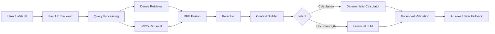

# nano_finance

*Financial Domain LLM Training, Grounded RAG, Deterministic Calculation,
Validation, and Rootless Online Serving*

[中文版本](README.zh-CN.md)

---

## Project Overview

nano_finance is an end-to-end financial-domain language model and RAG system
built from the native [NanoChat](https://github.com/karpathy/nanochat) training
stack.

The project covers tokenizer adaptation, domain pretraining, supervised
fine-tuning, hybrid retrieval, deterministic financial calculations, grounded
answer validation, evaluation governance, and rootless online deployment —
all designed to run on a university server without root access, Docker, or
system-level tools.

---

## Core Problems Addressed

| Problem | Solution |
|---|---|
| English-native tokenizer is inefficient for Chinese financial text | Custom Byte-Level BPE tokenizer with 65K vocabulary |
| General-purpose LLM lacks financial domain knowledge | Domain-adapted pretraining + financial SFT |
| Vanilla RAG produces retrieval errors, numeric hallucinations, and unit mistakes | Hybrid retrieval (Dense + BM25 + RRF + Reranker) with hierarchical context |
| LLM free-form calculation lacks auditability | Deterministic Decimal-based financial calculator with evidence binding |
| Answers may lack sources or contain incorrect citations | Grounded validation pipeline with 6+ validation categories |
| University server: no root, no Docker, limited ports | Rootless three-service tmux deployment with SSH tunnel access |

---

## Core Capabilities

| Capability | Description |
|---|---|
| **Domain Tokenizer** | Byte-Level BPE, 65K vocab, Chinese-English + financial corpus |
| **Financial Pretraining & SFT** | Base pretraining → domain adaptation → supervised fine-tuning with assistant-only loss |
| **Hybrid RAG** | Dense retrieval + BM25 + RRF fusion + reranker + hierarchical context |
| **Deterministic Financial Calculator** | 9 financial operations, Decimal precision, evidence-bound operands, unit/scale validation |
| **Grounded Validation** | Answerability, claim extraction, numeric/unit/period/citation/calculation validation, repair-once, safe fallback |
| **Rootless Three-Service Deployment** | Model (18001) → Backend (18002) → Frontend (18003), tmux, SSH tunnel, health/smoke/restart verification |

---

## System Architecture



### Training Pipeline

```text
Raw Corpus → Financial Tokenizer → Base Pretraining → Domain Pretraining → SFT → Model Service → RAG Application
```

The architecture separates **model capability**, **system orchestration**,
**deterministic calculation**, **retrieval**, **validation**, and **online
deployment** into distinct, auditable layers. The deterministic calculator is a
system component, not model-native tool calling.

---

## Core Capabilities in Detail

### 1. Tokenizer & Training Pipeline

- Custom Byte-Level BPE tokenizer with 65K vocabulary
- Mixed Chinese-English general + Chinese financial corpus
- Base pretraining → domain adaptation → supervised fine-tuning
- Assistant-only loss during SFT

> Historical training data marked as *historical self-reported* is currently
> unavailable for independent verification.

### 2. Hybrid RAG

- **Dense Retrieval**: Semantic vector search via ChromaDB
- **BM25**: Sparse lexical retrieval for keyword matching
- **RRF Fusion**: Reciprocal rank fusion of dense and sparse results
- **Reranker**: Cross-encoder re-ranking of fused candidates
- **Hierarchical Context**: Document scope control, page-level chunking, source attribution
- **Context Sufficiency**: Automatic detection of insufficient context with safe refusal

### 3. Deterministic Financial Calculation

Nine deterministic operations implemented with Python `Decimal`:

| Operation | Description |
|---|---|
| `difference` | Absolute difference between two values |
| `growth_rate` | Percentage growth from base to target |
| `percentage_share` | Proportion of a part relative to a whole |
| `sum` | Summation of multiple values |
| `average` | Arithmetic mean of multiple values |
| `gross_margin` | (Revenue - COGS) / Revenue |
| `net_margin` | Net Income / Revenue |
| `debt_ratio` | Total Debt / Total Assets |
| `scale_conversion` | Unit conversion (e.g., millions to billions) |

Key guarantees:
- All operands must be bound to document, page, and chunk evidence
- Units and scale are validated before calculation
- Failure is fail-closed: no fallback to LLM recalculation
- Safe blocking when evidence is missing

### 4. Grounded Validation

The validation pipeline inspects every answer for:

- **Answerability**: Is the question answerable from available documents?
- **Claim Extraction**: Decompose the answer into verifiable claims
- **Numeric Validation**: Do cited numbers match source text?
- **Unit/Period Validation**: Are units and time periods correctly carried through?
- **Citation Validation**: Does every claim have a valid source reference?
- **Calculation Validation**: Are calculation operands traceable to evidence?
- **Unsupported Claim Validation**: Are any claims made without evidence?
- **Repair Once**: Single deterministic repair attempt (no LLM loop)
- **Safe Fallback**: Blocked/failed answers use safe fallback messages

The system reduces unsupported responses through deterministic validation and
fail-closed response handling.

### 5. Online Deployment

Three services run as user-space processes under tmux:

| Service | Port | Session Name |
|---|---|---|
| Model Service | 127.0.0.1:18001 | `nano-finance-model` |
| Backend Service | 127.0.0.1:18002 | `nano-finance-backend` |
| Frontend Service | 127.0.0.1:18003 | `nano-finance-frontend` |

Features:
- No root, no Docker, no systemd
- tmux-based process management with PID ownership verification
- Ordered startup: Model → Backend → Frontend
- Health checks, smoke tests, SSE stream validation, restart recovery
- SSH tunnel for remote access
- Server restart requires manual restart

---

## Verified Engineering Metrics

Only independently verifiable results are presented:

| Metric | Value | Meaning |
|---|---|---|
| Deterministic financial operations | 9 | Covers difference, growth rate, margin ratios, and unit conversion |
| Validation categories | 6+ | Numeric, unit/period, citation, calculation, unsupported claims, answerability |
| Online services | 3 | Model, backend, frontend |
| Phase 7 deployment acceptance | 42/42 | Full three-service link verification |
| Automated tests | 2,000+ | Passing, zero failures |
| Deployment smoke tests | 12/12 | Health, Q&A, calculation, SSE, restart |

For detailed metrics and their sources, see
[docs/showcase/verified-metrics.md](docs/showcase/verified-metrics.md).

> The following are explicitly **not** used as quality claims: synthetic
> held-out 0/54, unverifiable 17.68B tokens, unreproduced tokenizer compression
> rate, unverified checkpoint hashes, failed experiment BPB, or any
> "production-grade accuracy" statements.

---

## Demo

Five demonstration scenarios are documented in
[docs/showcase/demo-guide.md](docs/showcase/demo-guide.md):

1. **Financial Report Q&A**: Upload a document, ask questions, view sources with page numbers
2. **Deterministic Financial Calculation**: Growth rate and margin computation with operand traceability
3. **Unit/Period Ambiguity**: System blocks ambiguous calculations instead of guessing
4. **Unanswerable Questions**: Safe refusal when evidence is absent
5. **Online Three-Service Status**: Model/Backend/Frontend readiness and SSH tunnel access

Screenshots are available in [assets/demo/](assets/demo/).

---

## Quick Start

### Local Development

See project-specific setup in `finquery_rag/` for backend and frontend
dependencies.

### Online Deployment (University Server)

```bash
# Start all three services
bash scripts/deploy/start_all.sh

# Check service status
bash scripts/deploy/status.sh

# Run health check
python scripts/deploy/healthcheck.py
```

### SSH Tunnel Access

```bash
ssh -N \
  -L 18003:127.0.0.1:18003 \
  -L 18002:127.0.0.1:18002 \
  <user>@<server>
```

Then open `http://127.0.0.1:18003` in a browser.

---

## Project Timeline

| Phase | Focus |
|---|---|
| Phase 1 | Retrieval Integrity |
| Phase 2 | RAG Orchestration |
| Phase 3 | Financial Calculation Pipeline |
| Phase 4 | Grounding & Validation |
| Phase 5 | Evaluation Infrastructure |
| Phase 6 | Release Evidence Classification |
| Phase 7 | Rootless Online Deployment |

Detailed documentation:

- [docs/architecture/](docs/architecture/)
- [docs/deployment/](docs/deployment/)
- [docs/release/](docs/release/)
- [docs/showcase/](docs/showcase/)

---

## Documentation Index

| Document | Description |
|---|---|
| [docs/showcase/demo-guide.md](docs/showcase/demo-guide.md) | Step-by-step demo walkthrough |
| [docs/showcase/demo-script.md](docs/showcase/demo-script.md) | Demo script for presentations |
| [docs/showcase/verified-metrics.md](docs/showcase/verified-metrics.md) | Verified engineering metrics |
| [docs/showcase/interview-guide.md](docs/showcase/interview-guide.md) | Interview preparation guide |
| [docs/showcase/resume-evidence.md](docs/showcase/resume-evidence.md) | Resume-ready project evidence |
| [docs/showcase/known-claims.md](docs/showcase/known-claims.md) | Claims that should not be made |
| [docs/deployment/online-deployment.md](docs/deployment/online-deployment.md) | Deployment guide |
| [docs/deployment/ssh-tunnel.md](docs/deployment/ssh-tunnel.md) | SSH tunnel setup |
| [docs/deployment/troubleshooting.md](docs/deployment/troubleshooting.md) | Troubleshooting guide |
| [docs/release/model-card.md](docs/release/model-card.md) | Model card |
| [docs/release/rag-system-card.md](docs/release/rag-system-card.md) | RAG system card |

---

## Known Limitations

- Model checkpoint verification relies on historical records (currently unavailable for independent verification)
- The system requires manual restart after server reboot
- No public internet access; SSH tunnel required for remote access
- No auto-scaling or multi-machine deployment
- Calculator is limited to the nine documented operations
- Validation is best-effort; it cannot guarantee elimination of all errors

See [docs/deployment/known-limitations.md](docs/deployment/known-limitations.md)
and [docs/release/limitations-and-risks.md](docs/release/limitations-and-risks.md)

---

## Upstream Project & Acknowledgements

nano_finance is built on [NanoChat](https://github.com/karpathy/nanochat) by
Andrej Karpathy — an experimental harness for training LLMs on a single GPU
node covering tokenization, pretraining, finetuning, evaluation, inference, and
a chat UI.

The original nanochat training stack provides the base training infrastructure,
GPT model architecture, tokenizer framework, and chat UI foundation that
nano_finance extends with financial domain capabilities.

Additional acknowledgements:

- [modded-nanoGPT](https://github.com/KellerJordan/modded-nanogpt) for pretraining optimization ideas
- [HuggingFace](https://hf-mirror.com/) for datasets (FineWeb, SmolTalk)
- [ChromaDB](https://www.trychroma.com/) for vector storage
- [FastAPI](https://fastapi.tiangolo.com/) for the backend framework

---

## License

MIT
