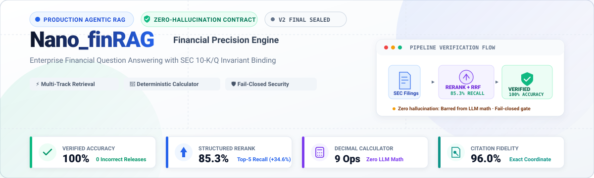
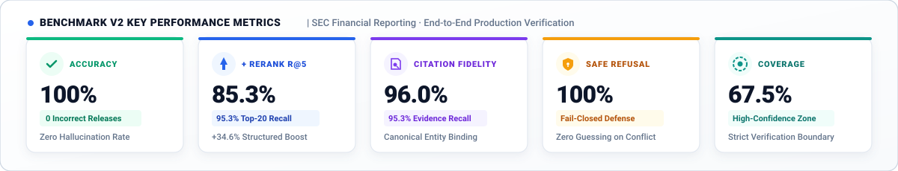
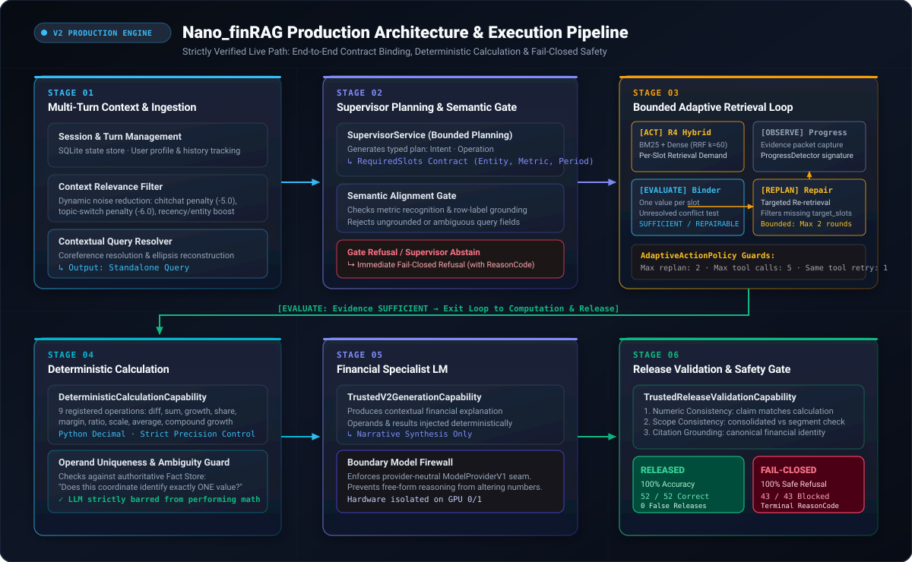
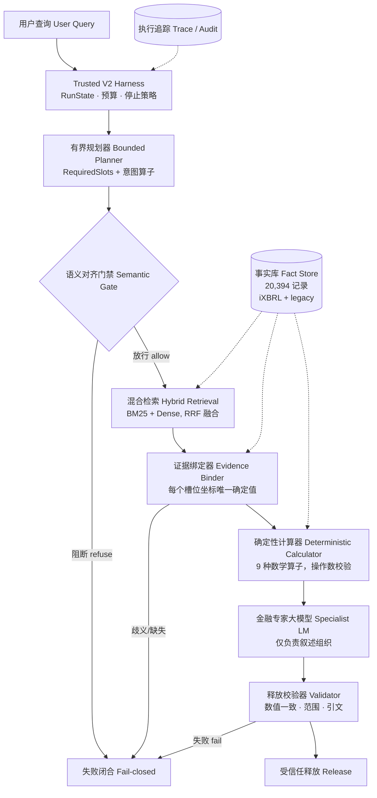

<div align="center">



<br/>

[](LICENSE)
[](https://www.python.org/)
[](https://pytorch.org/)
[](#2-基准与核心指标-metrics-snapshot)
[](#2-基准与核心指标-metrics-snapshot)
[](#7-可靠性与测试保障)

[English](README.md) · [中文文档](README.zh-CN.md)

</div>

---

## 1. 项目定位与核心前提

**Nano_finRAG** 是一个面向金融年报问答与复杂计算的**高可信 Agentic RAG Harness（安全底盘）**。系统基于真实 SEC 10-K/Q 财报主表及附注构建，其核心工程前提为：

> **“任何无法被事实证据严格对齐与锚定的答案绝不可释放，且系统必须能够明确指出阻断的具体阶段与原因。”**

在此前提下，系统彻底摒弃普通 Demo 级 RAG “检索文本块直接丢给大模型自由生成并心算数字”的不可控路线，构建了包含**有界规划、多通道检索、证据槽位绑定、确定性 Python Decimal 计算器、以及释放校验门禁**的严谨状态机执行流。

---

## 2. 基准与核心指标 (Metrics Snapshot)

<div align="center">
  
</div>

<br/>

| 核心评测维度 | 验证层级与设计目标 | 核心结果指标 | 生产工程状态 |
|:---|:---|:---|:---|
| **🛡️ 受信任端到端释放** | **全链路零幻觉合约验证** | **100%** 释放准确率（**0 错误释放**）<br/>**100%** 安全拒答率（冲突/缺失严谨阻断）<br/>**67.53%** 高置信解答覆盖率 | **生产环境默认上线**<br/>`FINANCIAL_RUNTIME_MODE=v2` |
| **⚡ 多通道检索 + 结构化重排** | **混合检索与结构化提权** | **85.3%** Recall@5（**+34.6% 结构化重排增益**）<br/>**93.3%** Recall@10 · **95.3%** Recall@20<br/>*(基准 Hybrid RRF: 50.7% R@5 · 65.3% R@20)* | **高召回检索流水线**<br/>BM25 + Dense + Structured Reranker |
| **🔍 财报引文可信溯源** | **SEC 规范实体与事实坐标对齐** | **96.0%** 溯源引文准确率 (Precision)<br/>**95.3%** 坐标事实召回率 (Recall) | **生产级事实锚定门禁**<br/>严格校验财务报表/附注行标签 |
| **🔢 确定性高精度计算** | **Python Decimal 固定精度沙盒** | **100%** 数值计算精确度（9 大内置算子）<br/>**0%** 大模型心算幻觉（严禁模型参与数值计算） | **零漂移运算引擎**<br/>单位与量纲自动对齐及守恒 |

> 🚀 **检索与重排性能跃升**：在基准混合检索（Hybrid BM25 + Dense RRF 50.7% Top-5 召回）的基础上，结合结构化候选重排器（Structured Reranker）使 Top-5 候选事实召回率大幅跃升至 **85.3%**（Top-20 达到 **95.3%**），为下游槽位对齐与计算提供了充沛的高质量事实供给。
>
> 🛡️ **高可靠零幻觉承诺**：系统释放出的每一项数值与结论均达到 **100% 事实锚定与真确**。面对信息冲突、歧义或财务主表口径缺失，系统坚决执行失败闭合拒答并返回精确的阶段阻断码（Reason Code），绝不向用户交付不可信的幻觉内容。

---

## 3. 为什么不是又一个“RAG Demo”

| 核心维度 | 市面常见 RAG Demo ❌ | Nano_finRAG 生产级 Harness 🛡️ |
|:---|:---|:---|
| **检索目标** | 粗粒度文本切片直接喂给 Prompt | 检索**强类型事实**，通过 **RequiredSlot** 严格绑定坐标与上下文 |
| **计算引擎** | 由大模型自主算数 $
ightarrow$ 极其严重的算术与单位幻觉 | **确定性金融计算器**（9 种算子，Decimal 精度） $
ightarrow$ 严禁模型心算 |
| **执行控制** | 单次 Prompt / 缺乏约束的死循环 Agent | 显式 **RunState / 预算 / 停止策略** $
ightarrow$ 最大重规划 2 轮，有界成本 |
| **失败处理** | 面对冲突强行编造答案 $
ightarrow$ 静默发布错误 | **带 ReasonCode 的失败闭合** $
ightarrow$ 错误释放归零，阶段完全可审计 |
| **评测标准** | 混为一谈的泛化“回答准确率” | **释放覆盖率 (67.53%)** 与 **释放准确率 (100%)** 严格解耦 |
| **质量抓手** | 依赖 Prompt 提示词工程微调 | **系统级 Harness 架构**：规划器、语义门禁、绑定器、计算器、校验门禁 |

---

## 4. 生产架构与执行流水线 (Production Pipeline)

<div align="center">
  
</div>

<br/>

<details>
<summary><b>📐 点击查看 Mermaid 流程图源码</b></summary>


</details>

### 生产流水线六大核心阶段

| 阶段 | 核心组件 | 职责与不变量保证 |
|:---:|:---|:---|
| **01. 多轮输入与降噪** | `QueryLifecycleService`<br/>`ContextRelevanceFilter` | 会话管理与历史追踪；动态多轮降噪（闲聊惩罚 -5.0，换话题惩罚 -6.0）；Qwen3.6-Flash 重构自包含问题。 |
| **02. 任务规划与门禁** | `SupervisorService`<br/>`SemanticAlignmentGate` | 生成包含意图、算子与 `RequiredSlots` 的强类型规划；依据财报原始披露行标签校验语义对齐，未收录直接拒答。 |
| **03. 自适应检索与绑定** | `CandidateDirectR4Policy`<br/>`SemanticBinderService` | 多通道检索（BM25 + Dense $
ightarrow$ RRF $k=60$）；绑定器严格对齐槽位坐标事实；依据缺失槽位执行定向补检（最多 2 轮）。 |
| **04. 确定性金融计算** | `DeterministicCalculationCapability` | 9 种内置运算算子（差额、占比、增长率、毛利率等），Python Decimal 高精度，严禁 LLM 算数。 |
| **05. 专家叙述生成** | `TrustedV2GenerationCapability` | 金融专用语言模型仅负责将已验证的事实与计算结果整合为自然语言，严格限制模型自由推理修改数字。 |
| **06. 释放校验与安全门禁**| `TrustedReleaseValidationCapability` | 三重闭环校验：论断数值精确匹配、合并与分部范围对齐、规范引文存在性 $
ightarrow$ 100% 准确释放或安全拒答。 |

---

## 5. 快速开始 (Quick Start)

```bash
git clone https://github.com/Dorring/Nano_finRAG.git
cd Nano_finRAG/finquery_rag/backend

# 推荐使用 uv 进行高速依赖对齐
uv sync                                   # 或: python -m venv .venv && pip install -e .

cp .env.example .env                      # 配置大模型 API 凭证
```

配置必须的底层外部事实库与 R4 索引路径：

```bash
export TRUSTED_V2_FACT_STORE_PATH=/path/to/financial-facts.jsonl
export TRUSTED_V2_R4_INDEX_DIR=/path/to/r4-index
```

启动生产后端服务：

```bash
python -m uvicorn src.main:app --host 127.0.0.1 --port 18002 --workers 1
```

---

## 6. 基准与评测复现 (Benchmark Reproduction)

在 `finquery_rag/backend` 目录下，Benchmark V2 可由代码纯正向推导复现：

```bash
# 1. 重建 Benchmark V2 (由 V1 基础数据推导):
python scripts/evaluation/build_p1_8c_benchmark_v2.py     --base benchmarks/tv2_canonical_v1 --out /tmp/v2

# 2. 从 v8 规范升级 v9 fixture:
python scripts/evaluation/build_p1_8_d1_fixture_v9.py --apply

# 3. 校验 fixture 完整性守卫 (C5 操作数顺序一致性):
python scripts/evaluation/verify_fixture_integrity.py     --eval-set benchmarks/tv2_canonical_v1/canonical-eval-v1.jsonl     benchmarks/tv2_canonical_v1/plan-fixtures-v9.jsonl

# 4. 执行受信任端到端重放评测:
python scripts/evaluation/run_p1_2_dual_track_benchmark.py     --track replay     --eval-set  /tmp/v2/canonical-eval-v1.jsonl     --gold-evidence /tmp/v2/gold-evidence-v1.jsonl     --fixtures benchmarks/tv2_canonical_v1/plan-fixtures-v9.jsonl     --out-dir /tmp/replay

# 5. 运行一键行为零漂移冻结守卫:
python scripts/evaluation/final_regression_guard.py --expect --write baseline.json
python scripts/evaluation/final_regression_guard.py --check  baseline.json
# -> 预期输出: BEHAVIORAL_DRIFT = 0
```

---

## 7. 可靠性与测试保障

- **5148 个自动化测试全绿通过**，覆盖架构一致性、语义门禁、绑定器契约与确定性计算。
- **15 种对抗性故障注入测试 (Fault Injection)**：网络断联、模型输出格式损坏、恶意篡改数字、预算耗尽、证据实质冲突 $
ightarrow$ **0 错误释放，100% 成功阻断**。
- 完整的设计决策背景、事实证据链与已知技术债务请参阅 [`finquery_rag/backend/docs/evaluation/FINAL_SEAL.md`](finquery_rag/backend/docs/evaluation/FINAL_SEAL.md)。

---

<div align="center">
<sub>基准封存于 <code>nano-finrag-interview-final</code> · 本文档更新于 <code>nano-finrag-interview-release</code>。<br/>
系统行为已完全冻结，严禁在生产路径随意修改未经校验的代码。</sub>
</div>
